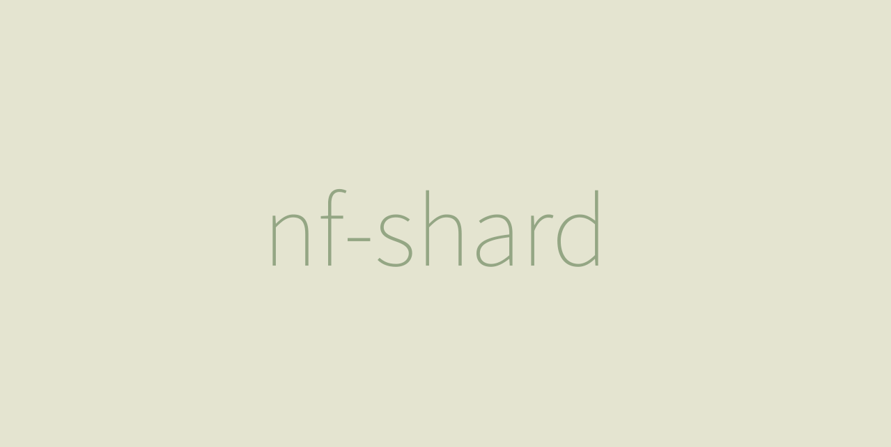
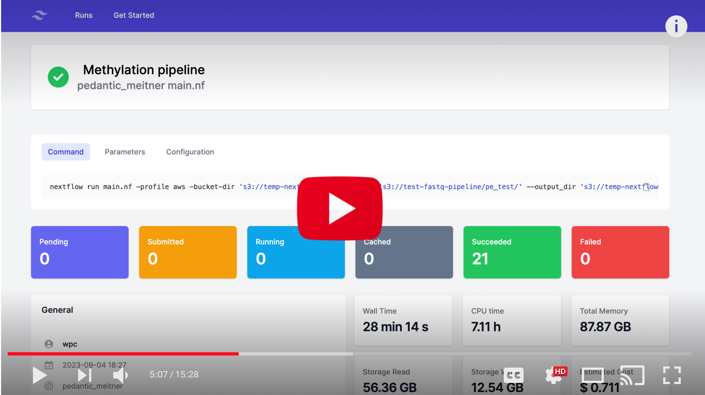

# nf-shard

nf-shard is an open source user interface for monitoring Nextflow runs, searching historical runs and analysing metrics. It was designed as drop-in replacement for community [nf-tower](https://github.com/seqeralabs/nf-tower), however it does not aim to replace Enterprise nf-tower.

[](https://www.youtube.com/watch?v=Fzq9cqozwEU)

## Usage

Following instructions allows to run `nf-shard` locally.

### Method 1 - docker-compose

docker-compose will spin up PostgreSQL database and the server.

```bash
git clone git@github.com:AugustDev/nf-shard.git
cd nf-shard
docker-compose up -d
yarn migrate
```

Add tower server details in your Nextflow config.

```nextflow
tower {
    enabled = true
    accessToken = "non-empty"
    endpoint = "http://localhost:3000/api"
}
```

Done! If you navigate to `http://localhost:3000` and run Nextflow workflow you should be able to see progress in the UI.

Note - `accessToken` can by any non-empty string.

### Method 2

If you already have running PostgreSQL database, you can run build project from package manager. To specify your database login edit `.env`.

```
yarn
yarn migrate
yarn build
yarn run
```

## Stack

- NextJS/React/Typescript
- PostgreSQL
- Prisma ORM

I was picking the a stack with large communities to maximise open source contribution from the Nextflow community.

## Features

- Indexed search by workflow ID, run name, user name, tag, projeect name, before date, after date.
- Search supports multiple `AND` conditions.
- Ability to attach multiple tags for each workflow. Tags are visible in the UI and can be used in search.
- List of historical runs
- Run details
- `nf-tower` plugin compatible API.

## Roadmap

- Authentication
- Dedicated plugin
- Upload/view execution logs
- Download reports
- [tRPC](https://trpc.io/) client/server communication

## Deployment to production

Instructions of how to deploy to production are coming soon.
